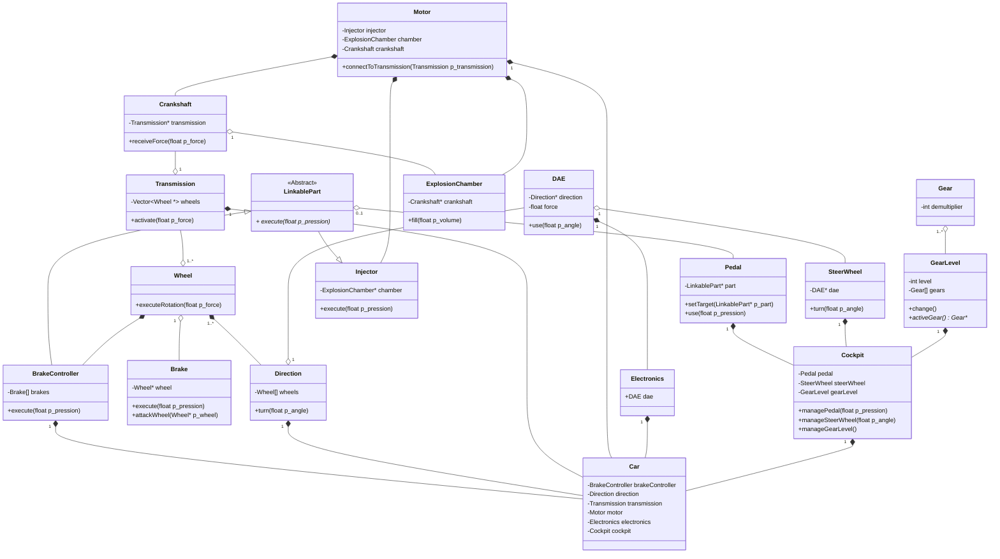

```mermaid
classDiagram
	class LinkablePart {
		<<Abstract>>
		+ execute(float p_pression)*
	}

	class Wheel {
		+executeRotation(float p_force)
	}

	class Gear {
		-int demultiplier
	}

	class GearLevel {
		-int level
		-Gear[] gears
		+change()
		+activeGear() Gear**
	}
	Gear "1..*" o-- GearLevel

	class Transmission {
		-Vector~Wheel *~ wheels
		+activate(float p_force)
	}
	Transmission --o "1..*" Wheel

	class Pedal {
		-LinkablePart* part
		+setTarget(LinkablePart* p_part)
		+use(float p_pression)
	}
	LinkablePart "0..1" o-- Pedal

	class Injector {
		-ExplosionChamber* chamber
		+execute(float p_pression)
	}
	LinkablePart --|> Injector

	class Crankshaft {
		-Transmission* transmission
		+receiveForce(float p_force)
	}
	Crankshaft --o "1" Transmission

	class ExplosionChamber {
		-Crankshaft* crankshaft
		+fill(float p_volume)
	}
	Crankshaft "1" o-- ExplosionChamber

	class Motor {
		-Injector injector
		-ExplosionChamber chamber
		-Crankshaft crankshaft
		+connectToTransmission(Transmission p_transmission)
	}
	Motor *-- Injector
	Motor *-- ExplosionChamber
	Motor *-- Crankshaft

	class Direction {
		-Wheel[] wheels
		+turn(float p_angle)
	}
	Wheel "1..*" *-- Direction

	class DAE {
		-Direction* direction
		-float force
		+use(float p_angle)
	}
	DAE --o "1" Direction

	class SteerWheel {
		-DAE* dae
		+turn(float p_angle)
	}
	DAE "1" o-- SteerWheel

	class Brake {
		-Wheel* wheel
		+execute(float p_pression)
		+attackWheel(Wheel* p_wheel)
	}
	Wheel "1" o-- Brake

	class BrakeController {
		-Brake[] brakes
		+execute(float p_pression)
	}
	LinkablePart <|-- BrakeController
	Wheel "1..*" *-- BrakeController

	class Cockpit {
		-Pedal pedal
		-SteerWheel steerWheel
		-GearLevel gearLevel
		+managePedal(float p_pression)
		+manageSteerWheel(float p_angle)
		+manageGearLevel()
	}
	Pedal "1" *-- Cockpit
	SteerWheel "1" *-- Cockpit
	GearLevel "1" *-- Cockpit

	class Electronics {
		+DAE dae
	}
	DAE "1" *-- Electronics

	class Car {
		-BrakeController brakeController
		-Direction direction
		-Transmission transmission
		-Motor motor
		-Electronics electronics
		-Cockpit cockpit
	}
	BrakeController "1" *-- Car
	Direction "1" *-- Car
	Transmission "1" *-- Car
	Motor "1" *-- Car
	Electronics "1" *-- Car
	Cockpit "1" *-- Car

```